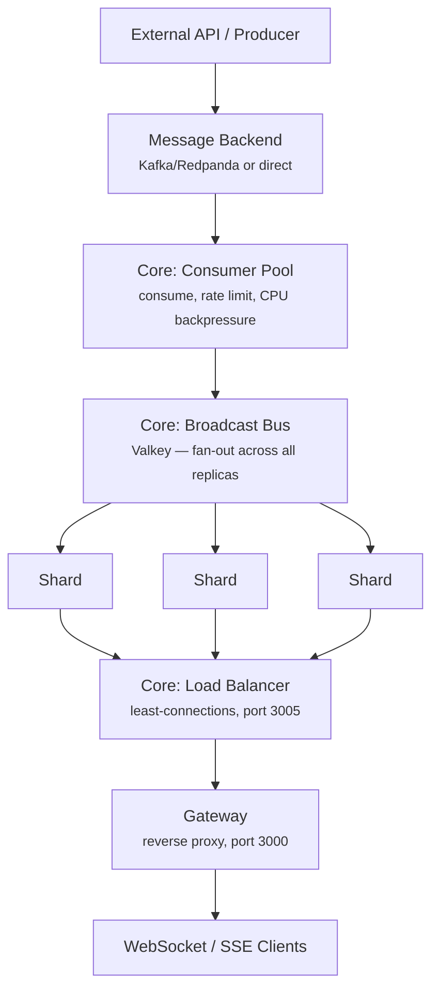
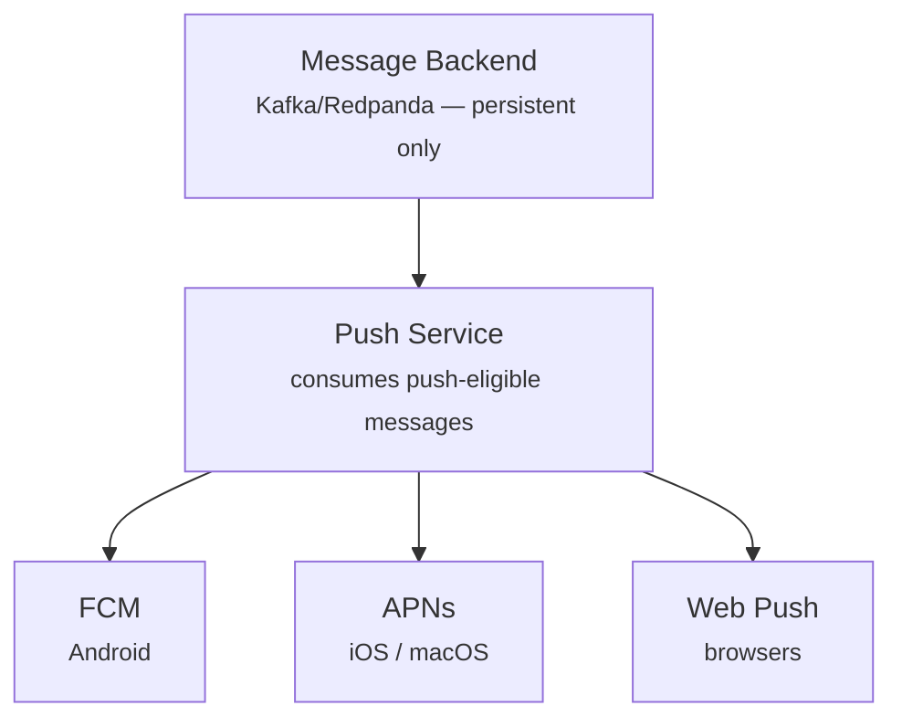
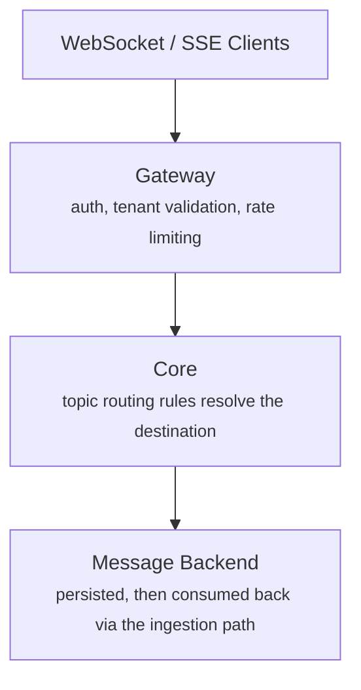

# Architecture

Sukko is a multi-service platform that ingests messages from a pluggable message backend (Kafka/Redpanda or direct) and delivers them to clients via WebSocket, SSE, and push notifications (FCM, APNs, Web Push).

## Components

| Service | Role | Port |
|---------|------|------|
| **Gateway** | Single entry point. WebSocket/SSE reverse proxy, REST publish, push device registration. Also proxies provisioning API requests — no need to expose provisioning separately. | 3000 |
| **Core** | Message server. Backend consumption, broadcast bus, sharded connections with internal load balancer. | 3005 |
| **Provisioning** | Internal REST + gRPC API. Tenants, keys, channel rules, routing rules, quotas. Accessed through the gateway proxy. Streams config to gateway and core via gRPC. | 8080 (internal) |
| **Push** | Push notification service. Consumes from Kafka, dispatches to FCM, APNs, and Web Push. Requires a persistent backend (not direct). | 3009 |
| **Tester** | Test orchestration. Smoke, load, stress, soak, and validation suites. | 8090 |

## Data Flow

### Ingestion (Backend → Clients)

Each shard maintains its own subscription index for O(1) subscriber lookup.

Every Core instance both consumes from the message backend and subscribes to the broadcast bus. The consumer pool ingests messages and publishes them to the bus. Each shard receives from the bus and delivers to its local clients. When running multiple Core replicas, the bus ensures every replica receives every message.

### Push Notifications (Backend → Mobile/Browser)

The Push service runs independently from the real-time path. It consumes from the message backend, matches messages against per-tenant push channel patterns, and dispatches to registered devices via FCM, APNs, or Web Push. Push requires a persistent backend — direct mode is not supported.

### Client Publish (Clients → Backend)

Client-published messages flow through the gateway for auth and rate limiting, then Core routes them to the correct destination based on per-tenant routing rules. From there, they re-enter the ingestion path and fan out to all subscribers — including the publisher if subscribed.

## Sharded Architecture

The Core server distributes connections across **shards** — internal server instances, each with its own port. The shard count is configurable via `WS_NUM_SHARDS` (default: 1) and edition-gated via `MaxShards`. Each shard:

- Owns a subset of connections
- Has a dedicated write pump per client
- Maintains a **subscription index** for O(1) subscriber lookup — no full-client scan on every message

The internal **load balancer** (port 3005) sits in front of the shards and distributes incoming connections using a least-connections strategy. The gateway proxies to the load balancer, not directly to shards.

## Broadcast Bus

The broadcast bus (Valkey, configurable via `BROADCAST_TYPE`) handles inter-instance message distribution:

1. A shard on the consuming Core instance delivers to its local subscribers, then publishes to the bus
2. Shards on every other Core instance receive the message from the bus
3. Each routes to local subscribers via its subscription index

## Three-Layer Message Protection

The message consumer has three protection layers:

1. **Rate Limiting** — caps consumption rate from the backend (configurable via `WS_MAX_KAFKA_RATE`)
2. **CPU Emergency Brake** — pauses consumption when CPU exceeds threshold (default: 70%) with hysteresis to prevent flapping
3. **Slow Client Detection** — disconnects clients that can't keep up after repeated failed delivery attempts, tracked via Prometheus metrics

## Next Steps

- **[Multi-Tenancy](./multi-tenancy)** — How tenant isolation works
- **[Channels](./channels)** — Public, user-scoped, and group-scoped patterns
- **[Message Backends](./message-backends)** — Kafka and direct modes
- **[Security](../security)** — How Sukko secures every layer
